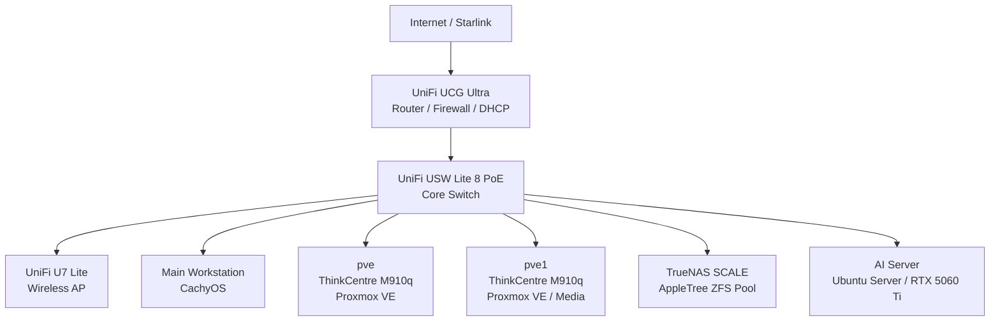

# Austin's Homelab Infrastructure

A living portfolio of my self-hosted homelab, built to develop practical experience with Linux administration, virtualization, networking, storage, Docker, monitoring, remote access, and cybersecurity.

The environment centers on two Proxmox VE nodes, a dedicated TrueNAS SCALE server, Docker-based application hosting, UniFi networking, Tailscale remote access, and Prometheus/Grafana monitoring. This repository documents the environment as it exists today, including current limitations instead of presenting planned improvements as completed work.

## Architecture at a Glance

## Core Technologies

| Area | Technologies |
|---|---|
| Virtualization | Proxmox VE, VMs, LXC |
| Containers | Docker, Docker Compose |
| Storage | TrueNAS SCALE, ZFS, NFS, SMB/CIFS |
| Networking | UniFi, AdGuard Home, NGINX Proxy Manager |
| Remote Access | Tailscale subnet routing |
| Monitoring | Prometheus, Grafana, UniFi Network |
| Power / Resilience | UPS, Network UPS Tools (NUT) |
| Operating Systems | CachyOS, Debian, Ubuntu Server, Home Assistant OS |

## Documentation

- [Overall Architecture](docs/architecture.md)
- [Physical Hardware](docs/hardware.md)
- [Proxmox and Virtualization](docs/virtualization.md)
- [Docker Services](docs/docker.md)
- [Storage](docs/storage.md)
- [Networking](docs/networking.md)
- [Security](docs/security.md)
- [Monitoring](docs/monitoring.md)
- [Backup and Recovery](docs/backup-recovery.md)

## Current Environment Highlights

- Two Lenovo ThinkCentre M910q systems operating as Proxmox VE nodes.
- TrueNAS SCALE with a two-disk ZFS mirror providing centralized storage.
- Separate general-purpose and media-focused Docker hosts.
- AdGuard Home for LAN DNS filtering with Quad9 DNS-over-HTTPS upstream resolution.
- NGINX Proxy Manager for internal hostname-based reverse proxying and TLS termination.
- Tailscale subnet routers for remote access without public administrative port forwarding.
- Prometheus and Grafana monitoring both Proxmox nodes and their virtualized workloads.
- Dedicated NVIDIA GPU server for local AI/LLM workloads.
- NUT-based UPS monitoring and graceful-shutdown support.

## Current Limitations

This repository documents the current state rather than hiding incomplete areas. At present:

- The network uses a single flat LAN with no VLAN segmentation.
- TrueNAS snapshots and replication are not configured.
- Proxmox VM/LXC backup jobs are not configured.
- Centralized log aggregation is not configured.
- Monitoring alerting is not currently configured.
- Uptime Kuma is installed but does not currently have active monitors.

These items may be addressed as the environment evolves and will be documented when implemented.

## Security Notes

No passwords, API tokens, SSH private keys, TLS private keys, or live credential files should be stored in this repository. Configuration examples added later should use placeholders or `.env.example` files where appropriate.

## Acknowledgments

The original media and storage design was influenced by the [TechHutTV homelab project](https://github.com/TechHutTV/homelab). The environment documented here has since been modified and expanded to reflect my own hardware, storage architecture, services, networking, monitoring, and administrative practices.

## Project Status

Active and continuously evolving. Documentation will be updated as the homelab changes.