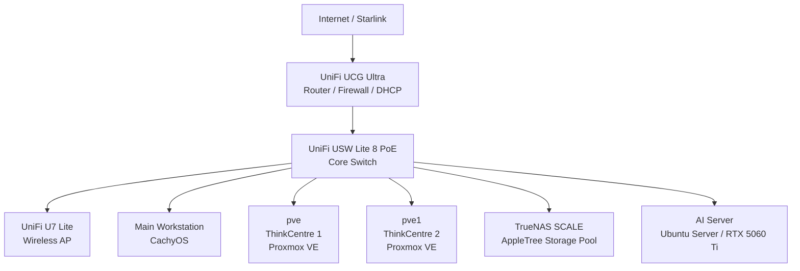

# Homelab Architecture

## Overview

This homelab is a self-hosted environment built around Proxmox virtualization, TrueNAS SCALE storage, Docker application hosting, UniFi networking, and Tailscale remote access.

The environment is distributed across two Lenovo ThinkCentre Proxmox nodes, a dedicated TrueNAS server, a dedicated AI/LLM compute server, and several supporting devices. Most application workloads are hosted in virtual machines, LXC containers, or Docker containers, while TrueNAS provides centralized network storage.

## High-Level Architecture



## Workload Layout

### `pve`

```text
pve
├── Debian VM
│   └── General-purpose Docker host
├── HAOS VM
│   └── Home Assistant
├── Tailscale LXC
│   └── Remote access / subnet router
├── AdGuard Home LXC
│   └── DNS filtering
├── Monitoring LXC
│   ├── Prometheus
│   └── Grafana
└── PostgreSQL LXC
    └── Paperless-ngx database
```

### `pve1`

```text
pve1
├── Servarr VM
│   └── Docker media environment
├── Tailscale LXC
│   └── Remote access / subnet router
└── Media LXC
    └── Samba storage gateway
```

## Storage Flow

TrueNAS SCALE provides centralized storage through the `AppleTree` ZFS pool. The `proxmox-nfs` dataset is exported to Proxmox using NFS and mounted as storage ID `proxmox`.

The media path uses an additional storage layer:

```text
TrueNAS SCALE
    │ NFS
    ▼
Proxmox pve1
    │ 7 TB RAW virtual disk
    ▼
Media LXC
/data - ext4
    │ SMB/CIFS
    ▼
Servarr VM
/data
    │
    ▼
Media Docker services
```

The Media LXC acts as a Samba storage gateway between Proxmox-backed TrueNAS storage and the Servarr VM.

## Network Flow

```text
Starlink
    │
    ▼
UCG Ultra
192.168.0.1
    │
    ▼
USW Lite 8 PoE
    ├── pve
    ├── pve1
    ├── TrueNAS
    ├── AI Server
    ├── Main Workstation
    └── U7 Lite
```

The LAN is currently `192.168.0.0/24` with no VLAN segmentation.

## DNS and Reverse Proxy

AdGuard Home at `192.168.0.128` provides LAN DNS filtering. The UCG Ultra distributes this address to DHCP clients. AdGuard forwards upstream queries to Quad9 using DNS-over-HTTPS.

NGINX Proxy Manager runs on the Debian VM at `192.168.0.16` and provides internal hostname routing and TLS termination.

Example:

```text
proxmox.peeps.cam
      │ DNS
      ▼
192.168.0.16
NGINX Proxy Manager
      │ reverse proxy
      ▼
Proxmox Web Interface
```

## Remote Access

Two Tailscale LXCs, one on each Proxmox node, advertise `192.168.0.0/24` as a subnet route. This allows remote management without directly forwarding administrative ports from the public Internet.

## Monitoring

Prometheus and Grafana run in the Monitoring LXC on `pve`.

Prometheus scrapes Proxmox exporter endpoints on:

- `192.168.0.10:9221` (`pve`)
- `192.168.0.11:9221` (`pve1`)
- `localhost:9090` for Prometheus self-monitoring

Grafana visualizes host, VM, LXC, storage, network, CPU, memory, and disk I/O metrics.

## Power and Resilience

An Amazon Basics 600 VA UPS protects both Proxmox nodes, TrueNAS, the AI server, and the main workstation. Network UPS Tools (NUT) is used for UPS monitoring and graceful shutdown behavior.

## Current-State Notes

The environment currently has no VLAN segmentation, no centralized log aggregation, no configured monitoring alerting, and no configured Proxmox backup jobs or TrueNAS snapshot/replication schedule. These are documented as current-state limitations rather than completed controls.